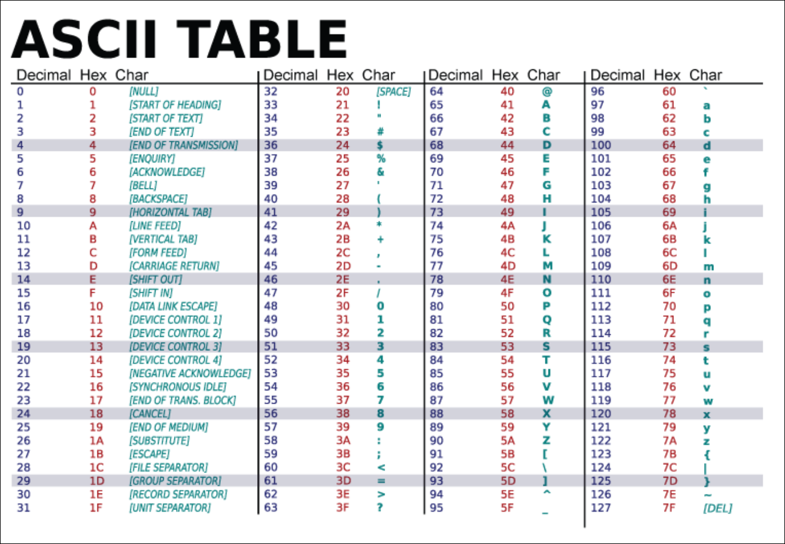

# Notes on Professional JavaScript for Web Developers by Matt Frisbie


<details>
<summary>Book Resources</summary> 

- [Source Code](http://www.wiley.com/go/projavascript5e)

</details>

<!-- omit in toc -->
# Contents
- [3. Language Basics](#3-language-basics)
  - [Data Types](#data-types)
    - [The `typeof` Operator](#the-typeof-operator)
    - [The `Undefined` Type](#the-undefined-type)
    - [The `Null` Type](#the-null-type)
    - [The `Boolean` Type](#the-boolean-type)
    - [The `Number` Type](#the-number-type)
      - [Number Conversions](#number-conversions)
    - [The `BigInt` Type](#the-bigint-type)
      - [`BigInt` Conversions](#bigint-conversions)
      - [`BigInt` Operators](#bigint-operators)
      - [`BigInt` Static Methods](#bigint-static-methods)
      - [Using `BigInt` with JSON](#using-bigint-with-json)
    - [The `String` Type](#the-string-type)
      - [Character Literals](#character-literals)
      - [String Conversions](#string-conversions)
      - [Template Literals](#template-literals)
      - [Interpolation](#interpolation)
      - [Template Literal Tag Functions (Tag Functions)](#template-literal-tag-functions-tag-functions)
      - [Raw Strings](#raw-strings)
    - [The `Symbol` Type](#the-symbol-type)
      - [Basic Symbol Use](#basic-symbol-use)
      - [Using the Global Symbol Registry](#using-the-global-symbol-registry)
      - [Using Symbols as Properties](#using-symbols-as-properties)
      - [Well-Known Symbols](#well-known-symbols)
    - [The `Object` Type](#the-object-type)
  - [Operators](#operators)
    - [Unary Operators](#unary-operators)
      - [Increment/Decrement](#incrementdecrement)
      - [Unary Plus and Minus](#unary-plus-and-minus)
    - [Bitwise Operators](#bitwise-operators)
      - [Bitwise NOT](#bitwise-not)
      - [Bitwise AND](#bitwise-and)
      - [Bitwise OR](#bitwise-or)
      - [Bitwise XOR](#bitwise-xor)
      - [Bitwise Left Shift](#bitwise-left-shift)
      - [Bitwise Right Shift](#bitwise-right-shift)
      - [Unsigned Right Shift](#unsigned-right-shift)
    - [Boolean Operators](#boolean-operators)
      - [Logical NOT](#logical-not)
      - [Logical AND](#logical-and)
      - [Logical OR](#logical-or)
    - [Multiplicative Operators](#multiplicative-operators)
      - [Multiply](#multiply)
      - [Divide](#divide)
      - [Modulus](#modulus)
      - [Exponentiation Operator](#exponentiation-operator)
    - [Additive Operators](#additive-operators)
      - [Add](#add)
      - [Subtract](#subtract)
    - [Relational Operators](#relational-operators)
    - [Equality Operators](#equality-operators)
      - [Equal (`==`) and Not Equal (`!=`)](#equal--and-not-equal-)
      - [Identically Equal (`===`) and Not Identically Equal (`!==`)](#identically-equal--and-not-identically-equal-)
    - [Conditional Operator](#conditional-operator)
    - [Nullish Coalescing Operator](#nullish-coalescing-operator)
    - [Assignment Operators](#assignment-operators)
    - [Comma Operator](#comma-operator)
  - [Statements](#statements)
    - [The `if` Statement](#the-if-statement)
    - [The `do-while` Statement](#the-do-while-statement)
    - [The `while` Statement](#the-while-statement)
    - [The `for` Statement](#the-for-statement)
    - [The `for...in` Statement](#the-forin-statement)
    - [The `for...of` Statement](#the-forof-statement)
    - [Labeled Statements](#labeled-statements)
    - [The `break` and `continue` Statements](#the-break-and-continue-statements)
    - [The `switch` Statement](#the-switch-statement)
  - [Functions](#functions)
- [4. Variables, Scope, and Memory](#4-variables-scope-and-memory)
  - [Primtive and Reference Values](#primtive-and-reference-values)
    - [Dynamic Properties](#dynamic-properties)
    - [Copying Values](#copying-values)
    - [Argument Passing (Pass-by-Value)](#argument-passing-pass-by-value)
    - [Determining Type (`typeof` and `instanceof`)](#determining-type-typeof-and-instanceof)
  - [Execution Context and Scope](#execution-context-and-scope)
    - [Scope Chain](#scope-chain)


## 3. Language Basics

**Declaration Best Practices**
- Don't use `var` - var can lead to unexpected behavior due to hoisting.
- Prefer `const` over `let`

### Data Types

#### The `typeof` Operator

Returns one of the following strings:
- "undefined" if the value is undefined
- "boolean" if the value is a boolean
- "string" if the value is a string
- "number" if the value is a number
- "object" if the value is an object
- "function" if the value is a function
- "symbol" if the value is a symbol
- "bigint" if the value is a BigInt

Calling `typeof null` returns an object, as the special value `null` is considered to be an empty object reference.

#### The `Undefined` Type
- Uninitialized variables are `undefined`. 
- `undefined` is falsy, but be careful in scenarios where you need to test for an exact value of undefined rather than just a falsy value.
- See [01-undefined_type.js](ch03/01-undefined_type.js) for examples.

#### The `Null` Type
- Like `undefined`, the Null type has only one value: `null`.
- When declaring a variable intended to hold an object, it's best to initialize it to null. This makes it easy to check later whether the variable has been assigned an object reference.
- See [02-null_type.js](ch03/02-null_type.js) for examples.

#### The `Boolean` Type
- Has only two values: `true` and `false`.
- These values are distinct from the numeric values 1 and 0, so `true == 1` is true, but `true === 1` is false.
-  All values have Boolean equivalents. The following table shows the data type, values converted to true, and values converted to false.

| Data Type | Values Converted to True                 | Values Converted to False |
| --------- | ---------------------------------------- | ------------------------- |
| Boolean   | true                                     | false                     |
| String    | Any non-empty string                     | "" (empty string)         |
| Number    | Any non-zero number (including Infinity) | 0, NaN                    |
| Object    | Any object reference                     | null                      |
| Undefined | N/A                                      | undefined                 |

For N/A, there are no values where undefined is converted to true.

- See [03-boolean_type.js](ch03/03-boolean_type.js) for examples.

#### The `Number` Type

- There are several literal formats of number types:
  - Decimal: `1234`, `0.1234`, `1.234e+2`, `1.234e-2`
  - Hexadecimal: `0xFF`, `0x1A3F`
  - Binary: `0b101010`, `0b11111111`
  - Octal: `0o755`, `0o777`

- Numbers created using binary, octal, or hexadecimal are treated as decimal numbers in all arithmetic operations.
- Numbers in JavaScript can have a positive zero or a negative zero value. Both are considered equivalent.
- Numbers with at least six zeroes after the decimal are converted to e-notation.

See [04-number_type.js](./ch03/04-number_type.js) for examples.

**Range of values:**
- `Number.MIN_VALUE` is the smallest positive number that can be represented in JavaScript and is approximately 5e-324.
- `Number.MAX_VALUE` is the largest positive number that can be represented in JavaScript and is approximately 1.7976931348623157e+308.
- `Infinity` is any positive number that can't be represented.
- `-Infinity` is any negative number that can't be represented.
- Use `Number.isFinite()` to check if a number is finite.

```js
  let result = Number.MAX_VALUE + Number.MAX_VALUE;
  console.log(isFinite(result)); // false
```

- `NaN` is used to indicate when an operation intended to return a number has failed.
- Any operation involving `NaN` always returns `NaN`.
```js
  console.log(NaN === NaN);         // false
  console.log(isNaN(NaN));          // true
  console.log(isNaN(10));           // false -- 10 is a number
  console.log(isNaN("10"));         // false -- "10" can be converted to a number
  console.log(isNaN("Hello"));      // true -- "Hello" cannot be converted to a number
  console.log(isNaN(true));         // false -- true can be converted to 1
```
- When `NaN` is used against objects, the object's `valueOf()` method is called to determine if it can be converted to a number. If it can't, `NaN` is returned.

##### Number Conversions
- There are three functions to convert nonnumeric values into numbers:
  - `Number()`: Converts a value to a number. If the value cannot be converted, it returns `NaN`.
  - `parseInt()`: Converts a string to an integer. If the string cannot be converted, it returns `NaN`. It ignores leading whitespace and stops parsing at the first non-numeric character.
  - `parseFloat()`: Converts a string to a floating-point number. It ignores leading whitespace and stops parsing at the first non-numeric character.
- The `Number()` function has a lot of complexities when converting string, so the author recommends using `parseInt()`  when you are dealing with integers.

**Note:** The `Number()` function is used by operators like `+`, `-`, `*`, `/`, and `%` to convert values to numbers before performing arithmetic operations.


```js
  console.log(Number("Hello world!")); // NaN
  console.log(Number(""));             // 0
  console.log(Number(null));           // 0
  console.log(Number(undefined));      // NaN
  console.log(Number("000011"));       // 11
  console.log(Number("1.52"));         // 1.52
  console.log(Number("-56"));          // -56
  console.log(Number(true));           // 1
```

```js
  console.log(parseInt("1234blue") );      // 1234
  console.log(parseInt("") );              // NaN
  console.log(parseInt("0xA") );           // 10 - hexadecimal
  console.log(parseInt(22.5) );            // 22 - ignores decimal part
  console.log(parseInt("70") );            // 70 - decimal
  console.log(parseInt("0xf") );           // 15 - hexadecimal
  console.log(parseInt("0xAF", 16));       // 175 - providing 16 radix to parse as hexadecimal
  console.log(parseInt("AF", 16));         // 175 - providing 16 radix to parse as hexadecimal; can leave off 0x
  console.log(parseInt("AF"));             // NaN - no radix provided, so it defaults to 10
  console.log(parseInt("10", 2));          // 2 - binary
  console.log(parseInt("10", 8));          // 8 - octal
  console.log(parseInt("10", 10));         // 10 - decimal
  console.log(parseInt("10", 16));         // 16 - hexadecimal
```
>Note: most of the time you'll be parsing decimal numbers, so it's good to always include the 10 as the radix argument.

```js
  console.log(parseFloat("1234blue")); // 1234 - integer
  console.log(parseFloat("0xA"));      // 0
  console.log(parseFloat("22.5"));     // 22.5
  console.log(parseFloat("22.34.5"));  // 22.34
  console.log(parseFloat("0908.5"));   // 908.5
  console.log(parseFloat("3.125e7"));  // 31250000
```
Things to note:
- A decimal point is valid the first time it appears in a string, but a second decimal point is invalid and the rest of the string is ignored.
- Initial zeros are ignored, but a leading zero followed by a decimal point is not ignored.
- If the string represents a whole number, `parseFloat()` will return an integer.

#### The `BigInt` Type

- Use `BigInt` when dealing with large integers that exceed `Number.MAX_SAFE_INTEGER`, which is 9007199254740991.
- `BigInt` allocates an object in memory to represent arbitrarily large integers that cannot fit inside a CPU register.
- Use a `BigInt` value only when dealing with values greater than 2^53.

```js
  console.log(Number.MAX_SAFE_INTEGER); // 9007199254740991
  console.log(2**53);                   // 9007199254740992 - not safe
  console.log(BigInt(12345));           // 12345n - BigInt
  console.log(BigInt(0x12345));         // 74565n - hexadecimal to BigInt
  console.log(BigInt("12345"));         // 12345n - string to BigInt
  console.log(BigInt("0o12345"));       // 5349n - octal to BigInt
  console.log(123n + 456n);             // 579n - BigInt addition
  console.log(123n + 456);              // TypeError - cannot mix BigInt and Number
```
- A `BigInt` is similar to a `Number`, but the two types cannot be mixed when using arithmetic or bitwise operators.
- A `BigInt` cannot be used with any built-in `Math` methods.

##### `BigInt` Conversions

```js
  console.log(123n === BigInt(123));                // true - BigInt comparison
  console.log(123 === Number(123n));                // true - Number comparison
  // Note: loss of precision may occur when converting large BigInt to Number
  console.log(Number(BigInt(100000000000054321)));  // 100000000000054320
  console.log(Number(54321n + BigInt(1e16)));       // 10000000000054320
  console.log(BigInt(0.5));                         // Range error - cannot convert to BigInt because it is not an integer
```

##### `BigInt` Operators

```js
  console.log(10n ** 2n);           // 100n - exponentiation
  console.log(100n / 3n);           // 33n - division
  console.log(16n | 8n);            // 24n - bitwise OR
  console.log(-8n + -8n);           // -16n - addition
  console.log(4n > 3);              // true - comparison
  console.log([5n, 1, 3n].sort());  // [1, 3n, 5n] - sorting
```
- Two operators are not supported with `BigInt`:
  - The zero-fill right shift operator `>>>`.
  - The unary `+` operator.
- Although mixing is not allowed with aritemetic and bitwise operators, you can still use comparison operators and sorting.

##### `BigInt` Static Methods

- `BigInt` has two static methods for clamping integers. Clamping means truncating it to a given number of least significant bits.
  - `BigInt.asIntN(width, x)`: Clamps the integer `x` to a signed integer of `width` bits.
  - `BigInt.asUintN(width, x)`: Clamps the integer `x` to an unsigned integer of `width` bits.
- A `BigInt` is represented in memory as a 2's complement signed integer, so clamping methods must be used with caution, as they could result in unexpected numbers.

```js
  // Clamps 0011000 to 1000
  console.log(BigInt.asIntN(4, 24n));   // -8n, given 2's complement representation
  console.log(BigInt.asUintN(4, 24n));  // 8n
  // Clamps 11111111 to 1111
  console.log(BigInt.asIntN(4, -1n));   // -1n, given 2's complement representation
  console.log(BigInt.asUintN(4, -1n));  // 15n
  // Clamps 00010000 to 10000
  console.log(BigInt.asIntN(5, 16n));   // -16n, given 2's complement representation
  // Clamps 00010000 to 010000
  console.log(BigInt.asIntN(6, 16n));   // 16n, given 2's complement representation
```

##### Using `BigInt` with JSON

- `BigInt` does not support JSON serialization, so you need to convert it to a string before using `JSON.stringify()`.
- You can provide replacer and reviver methods to convert in and out:
```js
  let data = {
    bigNumber: 1234n
  };

  // JSON.stringify(data); // TypeError: BigInt value cannot be serialized to JSON

  console.log(data.bigNumber.toString()); // "1234"

  // To serialize BigInt, convert it to string or number first using a replacer function
  // k represents the key, v represents the value
  const replacer = (k, v) => typeof v === 'bigint' ? v.toString() : v;

  // Serialize the object with BigInt
  console.log(JSON.stringify(data, replacer)); // {"bigNumber":"1234"}

  // Deserialize the object with BigInt
  const reviver = (k, v) => k === "bigNumber" ? BigInt(v) : v;
  console.log(JSON.parse(`{"bigNumber": "1234"}`, reviver)); // { bigNumber: 1234n }
```

#### The `String` Type

- The `String` type represents a sequence of one or more 16-bit Unicode characters.
- Strings can be delineated by single quotes, double quotes, or backticks (template literals).

##### Character Literals

| LITERAL | MEANING                                                                                                  |
| ------- | -------------------------------------------------------------------------------------------------------- |
| \n      | New line                                                                                                 |
| \t      | Tab                                                                                                      |
| \b      | Backspace                                                                                                |
| \r      | Carriage return                                                                                          |
| \f      | Form feed                                                                                                |
| \\      | Backslash (\)                                                                                            |
| \'      | Single quote (')—used when the string is delineated by single quotes. Example: 'He said, \'hey.\''.      |
| \"      | Double quote (")—used when the string is delineated by double quotes. Example: "He said, \"hey.\""       |
| \`      | Backtick (\`)—used when the string is delineated by backticks. Example: \`He said, \`hey.\`\`.           |
| \xnn    | A character represented by hexadecimal code nn (where n is a hexadecimal digit 0-F). Example: \x41 = "A" |
| \unnnn  | A Unicode character represented by the hexadecimal code nnnn (0-F). Example: \u03a3 = Greek Σ            |


Character literals can be included anywhere in a string:
```js
  text = "This is the sigma letter: \u03A3";
  console.log(text);         // This is the sigma letter: Σ
  console.log(text.length);  // 27
```
- Use the `length` property to get the number of characters in a string.
> Note: If a string contains double-byte characters, the length may not accurately reflect the number of characters in the string.

##### String Conversions

There are two ways to convert a value to a string:
- Use the `toString()` method of the value.
- Use the `String()` casting function to convert any value to a string.

```js
  // Method 1: using toString()
  let age = 11;
  let ageAsString = age.toString();    // "11"
  let found = true;
  let foundAsString = found.toString();  // "true" as a string

  // For numbers, toString() can take a radix (base) as an argument
  let num = 10;
  console.log(num.toString());    // 10
  console.log(num.toString(2));   // 1010 - binary
  console.log(num.toString(8));   // 12 - octal
  console.log(num.toString(10));  // 10 - decimal
```

```js
  // Method 2: Use the String() casting function to convert any value to a string
  let value1 = 10;
  let value2 = true;
  let value3 = null;
  let value4;

  console.log(String(value1)); // "10"
  console.log(String(value2)); // "true"
  console.log(String(value3)); // "null"
  console.log(String(value4)); // "undefined"
```
The `String()` function follows these rules:
  - If the value has a `toString()` method, it calls that method and returns the result.
  - If the value is `null`, it returns the string "null".
  - If the value is `undefined`, it returns the string "undefined".

##### Template Literals

- Template literals are enclosed in backticks (`` ` ``) and can span multiple lines.
```js
  let myMultiLineString = 'first line\nsecond line';
  let myMultiLineTemplateLiteral = `first line
second line`;

  console.log(myMultiLineString);
  // first line
  // second line

  console.log(myMultiLineTemplateLiteral);
  // first line
  // second line

  console.log(myMultiLineString === myMultiLineTemplateLiteral); // true
```

##### Interpolation

- Template literals support string interpolation, allowing you to embed expressions inside the string using `${}` syntax.
```js
  let value = 5;
  let exponent = 'second';

  // Prior to interpolation, we would have to use concatenation
  let interpolatedString = value + 'to the ' + exponent + ' power is ' + (value * value);

  // The same thing accomplished with template literals
  let interpolatedTemplateLiteral = `${value} to the ${exponent} power is ${value * value}`;

  console.log(interpolatedString);           // 5 to the second power is 25
  console.log(interpolatedTemplateLiteral);  // 5 to the second power is 25
```

Template literals also support expressions:
```js
  console.log(`Hello, ${`World`}!`); // Hello, World!

  // `String()` is invoked to coerce the expression to a string
  let foo = { toString: () => 'World' };
  console.log(`Hello, ${foo}!`);

  // Invoking functions and methods inside interpolated expressions
  // `word[0]` is the first character of the string
  // `word.slice(1)` is the rest of the string, starting from the second character
  function capitalize(word) {
    return `${word[0].toUpperCase()}${word.slice(1)}`;
  }
  console.log(`${capitalize('hello')}, ${capitalize('world')}!`); // Hello, World!
```

Template literals can safely interpolate their previous value:
```js
  let value = '';
  function append() {
    value = `${value}abc`
    console.log(value);
  }
  append(); // abc
  append(); // abcabc
  append(); // abcabcabc
```

##### Template Literal Tag Functions (Tag Functions)

*Tag functions* enable you to define custom interpolation behavior for template literals. Tag functions are useful in that they allow you to intercept the template literal and modify it before it is processed. This can be useful for:
- Escaping or sanitizing user input
- Localization
- Custom formatting

```js
  let a = 6;
  let b = 9;
  function simpleTag(strings, aValExpression, bValExpression, sumExpression) {
    console.log(strings);
    console.log(aValExpression);
    console.log(bValExpression);
    console.log(sumExpression);
    return 'foobar';
  }
  let untaggedResult = `${a} + ${b} = ${a + b}`;
  let taggedResult = simpleTag`${a} + ${b} = ${a + b}`;  // 

  console.log(untaggedResult);     // 6 + 9 = 15
  console.log(taggedResult);       // foobar
```
**Output:**  
```bash
(4) ['', ' + ', ' = ', '', raw: Array(4)]       # First argument is an array of strings, representing the static parts of the template literal
6                                               # console.log(aValExpression) - the first evaluated expression, ${a}
9                                               # console.log(bValExpression) - the second evaluated expression, ${b}
15                                              # console.log(sumExpression) - the third evaluated expression, ${a + b}
6 + 9 = 15                                      # console.log(untaggedResult)
foobar                                          # console.log(taggedResult)
```
**Notes:**
- The tag function receives the template literal and splits it into its pieces.
- The first argument is an array of strings, representing the static parts of the template literal.
- The remaining arguments are the results of the evaluated expressions.

Because there are a variable number of expression arguments, using the spread operator (`...`) allows you to combine them into a single array:
```js
  let a = 6;
  let b = 9;
  function simpleTag(strings, ...expressions) {
    console.log(strings);
    for (const expression of expressions) {
      console.log(expression);
    }
    return 'foobar';
  }
  let taggedResult = simpleTag`${a} + ${b} = ${a + b}`;
  // (4) ['', ' + ', ' = ', '', raw: Array(4)]
  // 6
  // 9
  // 15
  console.log(taggedResult);       // foobar
```

You can work with the string array and the expression array to create custom behavior:
```js
  let a = 6;
  let b = 9;
  function zipTag(strings, ...expressions) {
    // In the map() function, `e` is the expression value and `i` is the index
    return strings[0] + expressions.map((e, i) => `${e}${strings[i + 1]}`).join('');
  }
  let untaggedResult = `${a} + ${b} = ${a + b}`;
  let taggedResult = zipTag`${a} + ${b} = ${a + b}`;

  console.log(untaggedResult);     // 6 + 9 = 15
  console.log(taggedResult);       // 6 + 9 = 15
```

##### Raw Strings

The `String.raw` tag function enables you to get the raw template literal contents without being converted into actual character representations, such as new line or Unicode characters. This is useful when
- working with raw source code, e.g. embedding regular expressions
- writing Windows file paths, to avoid using double backslashes
- avoiding accidental escapes, sometimes you want `\n` literally in the output , e.g. when generating config files, documentation, templates
- handling multiline templates cleanly, i.e. when you want raw newlines and not processed ones

```js
  // Unicode demo
  // \u00A9 is the copyright symbol ©
  console.log('\u00A9');            // ©
  console.log(String.raw`\u00A9`);  // \u00A9

  // Newline demo
  console.log(`first line\nsecond line`);
  // first line
  // second line
  console.log(String.raw`first line\nsecond line`);   // "first line\nsecond line"

  // This does not work for actual newline characters: they do not undergo conversion from their plaintext equivalents
  console.log(`first line
  second line`);
  // first line
  // second line
  console.log(String.raw`first line
  second line`);
  // first line
  // second lin
```

The raw values are availble as a property on each element in the string piece collection inside the tag function:

```js
  function printRaw(strings) {
    console.log('Actual characters:');
    for (const str of strings) {
      console.log(str);
    }
    console.log('Escaped characters:');
    for (const rawString of strings.raw) {
      console.log(rawString);
    }
  }
  printRaw`\u00A9${'and'}\n`;
  //Actual characters:
  // ©
  // (newline)

  // Escaped characters:
  // \u00A9
  // \n
```

#### The `Symbol` Type

Symbols are primitive values, and symbol instances are unique and immutable. The purpose of a symbol is to be a guaranteed unique identifier for object properties that does not risk property collision.

Symbols may seem similar to object private properties, but they are not the same. Symbols are intended to be used as unique tokens that can be used to key special properties with something other than a string.

##### Basic Symbol Use

Instantiating a symbol:

```js
  let sym = Symbol();
  console.log(typeof sym);  // symbol
```

The symbols you define are unique, even if they have the same description:

```js
  let genericSymbol = Symbol();
  let otherGenericSymbol = Symbol();
  console.log(genericSymbol === otherGenericSymbol);  // false

  let fooSymbol = Symbol('foo');
  let otherFooSymbol = Symbol('foo');
  console.log(fooSymbol === otherFooSymbol);  // false
```

You can use symbols as object property keys, without the risk of property collision:

```js
  let genericSymbol = Symbol();
  console.log(genericSymbol);   // Symbol()

  let fooSymbol = Symbol('foo');
  console.log(fooSymbol);      // Symbol(foo)
```

The `Symbol()` function cannot be used with the `new` operator. THe purpose of this is to avoide symbol object wrappers, as is possible with Boolean, String, and Number, which support constructor behavior.

```js
  let myBoolean = new Boolean();
  console.log(typeof myBoolean);  // object

  let myString = new String();
  console.log(typeof myString);   // object

  let myNumber = new Number();
  console.log(typeof myNumber);   // object

  let mySymbol = new Symbol();    // TypeError: Symbol is not a constructor
```

You can use the `Object()` function to convert a symbol to an object:

```js
  let mySymbol = Symbol();
  let myWrappedSymbol = Object(mySymbol);
  console.log(typeof myWrappedSymbol);  // object
```

##### Using the Global Symbol Registry

A global symbol registry allows you to create symbols that can be shared across different parts of the runtime. This is useful for creating symbols that need to be accessed by multiple modules or libraries without the risk of name collisions.

```js
  let fooGlobalSymbol = Symbol.for('foo');
  console.log(typeof fooGlobalSymbol);  // symbol
```

The `Symbol.for()` method is an idempotent operation. The first time it is called with a given string, it will check the global runtime registry, find that no symbol exists, generate a new symbol instance, and add it to the registry.

Additional invocations with the same string key will check the global runtime registry, find that a symbol does exist, and return that symbol instance:

```js
  let fooGlobalSymbol = Symbol.for('foo');  // creates new symbol
  let otherFooGlobalSymbol = Symbol.for('foo'); // reuses existing symbol
  console.log(fooGlobalSymbol === otherFooGlobalSymbol);  // true
```

Symbols defined in the global symbol registry are totally distinct from symbols created with the `Symbol()` function, even if they have the same description:

```js
  let localSymbol = Symbol('foo');
  let globalSymbol = Symbol.for('foo');
  console.log(localSymbol === globalSymbol);  // false
```

Anything you provide as an argument to `Symbol.for()` will be converted to a string, so you can use any value as a key:

```js
  let mySymbol = Symbol.for(12345);
  console.log(mySymbol);  // Symbol(12345)
```

The key used for the registry is also used as the symbol description:

```js
  let emptyGlobalSymbol = Symbol.for();
  console.log(emptyGlobalSymbol);  // Symbol(undefined)
```

You can check the global registry using `Symbol.keyFor()`. This method returns `undefined` if the symbol is not found in the global registry:

```js
  // Global symbol
  let s = Symbol.for('foo');
  console.log(Symbol.keyFor(s)); // foo

  // Regular symbol
  let s2 = Symbol('foo');
  console.log(Symbol.keyFor(s2)); // undefine
```

Using `Symbol.keyFor()` with a non-symbol value will throw a `TypeError`:

```js
  Symbol.keyFor(123);  // TypeError: Symbol.keyFor requires that its argument be a symbol
```

##### Using Symbols as Properties

You can use a symbol anywhere you would normally use a string or number property:

```js
  let s1 = Symbol('foo'),
      s2 = Symbol('bar'),
      s3 = Symbol('baz'),
      s4 = Symbol('qux');

  let o = {
    [s1]: 'foo val'
  };
  // Also valid: o[s1] = 'foo val';
  console.log(o);
  // { [Symbol(foo)]: 'foo val' }

  Object.defineProperty(o, s2, { value: 'bar val' });
  console.log(o);
  // { [Symbol(foo)]: 'foo val', [Symbol(bar)]: 'bar val' }

  Object.defineProperties(o, {
    [s3]: { value: 'baz val' },
    [s4]: { value: 'qux val' }
  });
  console.log(o);
  // { [Symbol(foo)]: 'foo val', [Symbol(bar)]: 'bar val', [Symbol(baz)]: 'baz val', [Symbol(qux)]: 'qux val' }
```

Use the following methods to return properties and symbols from an object:
- `Object.getOwnPropertySymbols()`: Returns an array of all symbol properties of an object.
- `Object.getOwnPropertyNames()`: Returns an array of all string properties of an object.
- `Object.getOwnPropertyDescriptors()`: Returns an object containing both regular and symbol property descriptors.
- `Reflect.ownKeys()`: Returns an array of all string and symbol keys of an object.

```js
  let s1 = Symbol('foo'),
      s2 = Symbol('bar');

  let o = {
    [s1]: 'foo val',
    [s2]: 'bar val',
    baz: 'baz val',
    qux: 'qux val'
  }

  console.log(Object.getOwnPropertySymbols(o));
  // [ Symbol(foo), Symbol(bar) ]

  console.log(Object.getOwnPropertyNames(o));
  // [ 'baz', 'qux' ]

  console.log(Object.getOwnPropertyDescriptors(o));
  // {baz: {…}, qux: {…}, Symbol(foo): {…}, Symbol(bar): {…}}

  console.log(Reflect.ownKeys(o));
  // ['baz', 'qux', Symbol(foo), Symbol(bar)]
```

If you don't maintain an explicit reference to the symbol, you must traverse all the object's symbol properties to recover the property key:

```js
  let o = {
    [Symbol('foo')]: 'foo val',   // No explicit reference to the symbol
    [Symbol('bar')]: 'bar val'
  }

  console.log(o);
  // { [Symbol(foo)]: 'foo val', [Symbol(bar)]: 'bar val' }

  let barSymbol = Object.getOwnPropertySymbols(o).find((symbol) => symbol.toString().match(/bar/));
  console.log(barSymbol);  // Symbol(bar)
```

##### Well-Known Symbols

ECMAScript includes a collection of well-known symbols that are used to expose internal language behaviors for direct access, overriding, or emulating. These well-known symbols exist as string properties on the `Symbol` factory function.

In discussions about ECMAScript specification, you'lll see these symbols referred to by their specification names, which are prefixed with @@, e.g. `@@iterator` refers to Symbol.iterator.

###### Symbol.asyncInterator

This symbol is used as a property for "a method that returns the default `AsyncIterator` for an object. Called by the semantics of the `for-await` statement." Language constructs like `for-await` make use of this function to perform asynchronous iteration. In many cases, it takes the form of an `AsyncGenerator` object that implements the iterator API.

```js
  class Foo {
    async *[Symbol.asyncIterator](){}
  }

  let f = new Foo();

  console.log(f[Symbol.asyncIterator]());
  // AsyncGenerator {<suspended>}
```

The object produced by the `Symbol.asyncIterator` function should sequentially produce a `Promise` via its `next()` method.

```js
  class Emitter {
    constructor(max) {
      this.max = max;
      this.asyncIdx = 0;
    }

    async *[Symbol.asyncIterator]() {     // Define the async generator function 
      while (this.asyncIdx < this.max) {
        yield new Promise((resolve) => resolve(this.asyncIdx++));
      }
    }
  }

  async function asyncCount() {     // Create an async function to consume the async iterator
    let emitter = new Emitter(5);
    for await (const x of emitter) {
      console.log(x);
    }
  }
  asyncCount();
  // Output: 0, 1, 2, 3, 4
```

###### Symbol.hasInstance

This symbol is used as a property for a method that determines if a constructor object (1) recognizes an object as its instance and (2) is called by the semantics of the `instanceof` operator.

The `instanceof` operator determines if an object instance has a prototype in its prototype chain.

```js
  function Foo(){}
  let f = new Foo();
  console.log(f instanceof Foo);  // true

  class Bar{}
  let b = new Bar();
  console.log(b instanceof Bar);  // true
```

On the back end, the `instanceof` operator uses a `Symbol.hasInstance` function to evaluate this relationship. `Symbol.hasInstance` keys a function which performs the same behavior but with the operands reversed:

```js
  function Foo(){}
  let f = new Foo();
  console.log(Foo[Symbol.hasInstance](f));  // true

	class Bar{}
  let b = new Bar();
  console.log(Bar[Symbol.hasInstance](b));  // true
```

Since the `Symbol.hasInstance` property is defined on the `Function` prototype, it is automatically avaialable by default to all function and class definitions. Because the `instanceof` operator will seek the property definition on the prototype chain, it is possible to redefine the `Symbol.hasInstance` function  on an inherited class as a static method:

```js
  class Bar {}
  class Baz extends Bar {
    static [Symbol.hasInstance]() {
      return false;  // Override the default behavior
    }
  }

  let b = new Baz();
  console.log(Bar[Symbol.hasInstance](b)); // true
  console.log(b instanceof Bar);  // true
  console.log(Baz[Symbol.hasInstance](b)); // false
  console.log(b instanceof Baz);  // false
```

###### Symbol.isConcatSpreadable

This symbol is used as a Boolean-valued property that, if true, indicates an object should be flattened to its elements by `Array.prototype.concat()`.

The `Array.prototype.concat()` method will select how to join an array-like object to the array instance based on the type of object passed. The value of `Symbol.isConcatSpreadable` allows you to override this behavior.

Expected default behavior:
- Array objects: will be flattened into the existing array; a value of `false` or falsy value will append the entire object to the array.
- Array-like objects: will be appended to the array; a value of `true` or truthy value will flatten the array-like object into the array.
- Other objects (not array-like): will be ignored when `Symbol.isConcatSpreadable` is set to `true`

```js
  let initial = ['foo'];

  let array = ['bar'];
  console.log(array[Symbol.isConcatSpreadable]);            // undefined
  console.log(initial.concat(array));                       // ['foo', 'bar']
  array[Symbol.isConcatSpreadable] = false;                 // Set the symbol to false
  console.log(initial.concat(array));                       // ['foo', Array(1)]

  let arrayLikeObject = { length: 1, 0: 'baz' };
  console.log(arrayLikeObject[Symbol.isConcatSpreadable]);  // undefined
  console.log(initial.concat(arrayLikeObject));             // ['foo', {...}]
  arrayLikeObject[Symbol.isConcatSpreadable] = true;        // Set the symbol to true
  console.log(initial.concat(arrayLikeObject));             // ['foo', 'baz']

  let otherObject = new Set().add('qux');
  console.log(otherObject[Symbol.isConcatSpreadable]);      // undefined
  console.log(initial.concat(otherObject));                 // ['foo', Set(1)]
  otherObject[Symbol.isConcatSpreadable] = true;            // Set the symbol to true
  console.log(initial.concat(otherObject));                 // ['foo', 'qux']
```

###### Symbol.iterator

This symbol is used as a property for a method that returns the default iterator for an object. This property is used by the `for...of` statement, and other language constructs which iterate over iterable objects like arrays, strings, and other collections.

These language constructs invoke the function keyed by `Symbol.iterator` and expect it to return an object which implements the iterator API. In many cases, this takes the form of a generator function:

```js
  class Foo {
    *[Symbol.iterator]() {}     // Generator function
  }

  let f = new Foo();
  console.log(f[Symbol.iterator]());
  // Generator {[[GeneratorState]]: 'suspended'
```
The object produced by the `Symbol.iterator` function should sequentially produce a value via its `next()` method, which is called by the language constructs that iterate over the object.

```js
  class Emitter {
    constructor(max) {
      this.max = max;
      this.idx = 0;
    }

    *[Symbol.iterator]() {                // Define the generator function
      while (this.idx < this.max) {
        yield this.idx++;
      }
    }
  }

  function count() {
    let emitter = new Emitter(5);
    for (const x of emitter) {            // Use the generator in an iteratable language construct
      console.log(x);
    }
  }

  count();
  // Output: 0, 1, 2, 3, 4
```

###### Symbol.match

This symbol is used as a property for a regular expression method that matches against a string. It is called by the `String.prototype.match()` method.

The `String.prototype.match()` method uses the function keyed in `Symbol.match` to evaluate the expression.

The regular expression prototype has the `Symbol.match` method defined by default, so all regular expression instances are valid parameters to the `String` method by default:

```js
  console.log(RegExp.prototype[Symbol.match]);  // Showing that the regular expression prototype has a match method
  // Output: ƒ [Symbol.match]()

  console.log('foobar'.match(/bar/));           // Using a regular expression as a parameter to `String.prototype.match()` yields `Symbol.match`
  // Output: ['bar', index: 3, input: 'foobar', groups: undefined]
```

Providing something other than a regular expression will cause it to be converted to a `RegExp` object. If you wish to circumvent this behavior, and pass something other than a regular expression instance, you can define your own `Symbol.match` function:

```js
  class FooMatcher {
    static [Symbol.match](target) {     // Overriding the match method by providing a static method instead of a regular expression
      return target.includes("foo");
    }
  }

  console.log("foobar".match(FooMatcher)); // true
  console.log("barbaz".match(FooMatcher)); // false


  class StringMatcher {
    constructor(str) {
      this.str = str;
    }
    [Symbol.match](target) {          // Overriding the match method by providing a method on the instance instead of a regular expression
      return target.includes(this.str);
    }
  }

  console.log('foobar'.match(new StringMatcher('foo')));  // true
  console.log('barbaz'.match(new StringMatcher('foo')));  // false
```

###### Symbol.replace

This symbol is used as a property for a regular expression method that replaces matched substrings of a string. It is called by the `String.prototype.replace()` method. The first argument to `String.prototype.replace()` can be a string or an object with a `Symbol.replace` method.

```js
  console.log(RegExp.prototype[Symbol.replace]);  // Showing that the regular expression prototype has a replace method
  // Output: ƒ [Symbol.replace]()

  console.log('foobarbaz'.replace(/bar/, 'qux'));   // Using a regular expression to replace a substring
  // Output: 'fooquxbaz'
```

Similarly with `Symbol.match`, you can override this behavior to provide something other than a regular expression:

```js
  class FooReplacer {
    static [Symbol.replace](target, replacement) {            // Overriding the replace method
      return target.split('foo').join(replacement);
    }
  }

  console.log('barfoobaz'.replace(FooReplacer, 'qux'));
  // Output: 'barquxbaz'
  

  class StringReplacer {
    constructor(str) {
      this.str = str;
    }
    [Symbol.replace](target, replacement) {
      return target.split(this.str).join(replacement);
    }
  }

  console.log('barfoobaz'.replace(new StringReplacer('foo'), 'qux'));
  // Output: 'barquxbaz'
```

###### Symbol.search

This symbol is used as a property for a regular expression method that returns the index with a string that matches the regular expression. It is called by the `String.prototype.search()` method.

```js
  console.log(RegExp.prototype[Symbol.search]); // Showing that the regular expression prototype has a search method
  // Output:  ƒ [Symbol.search]()

  console.log('foobar'.search(/bar/));
  // Output: 3 (the index of the first match)
```

Providing something other than a regular expression will cause it to be converted to a `RegExp` object. You can circumvent this behavior by defining your own `Symbol.search` function:

```js
  class FooSearcher {
    static [Symbol.search](target) {
      return target.indexOf('foo');
    }
  }

  console.log('foobar'.search(FooSearcher)); // Output: 0
  console.log('barfoo'.search(FooSearcher)); // Output: 3
  console.log('barbaz'.search(FooSearcher)); // Output: -1 (not found)

  
  class StringSearcher {
    constructor(str) {
      this.str = str;
    }
    [Symbol.search](target) {
      return target.indexOf(this.str);
    }
  }

  console.log('foobar'.search(new StringSearcher('foo'))); // Output: 0
  console.log('barfoo'.search(new StringSearcher('foo'))); // Output: 3
  console.log('barbaz'.search(new StringSearcher('qux'))); // Output: -1 (not found)
```

###### Symbol.species

This symbol represents a property that holds the constructor function used to create derived objects. It lets you control which constructor is used when an object is cloned or when a new object is created from an existing one.

```js
  class Bar extends Array {}
  class Baz extends Array {
    static get [Symbol.species]() {   // Symbol.species is a static getter that returns the constructor to be used for derived objects
      return Array;
    }
  }


  let bar = new Bar();
  console.log(bar instanceof Array);  // true
  console.log(bar instanceof Bar);    // true
  bar = bar.concat('bar');            // Bar extends Array, so concat returns a Bar instance
  console.log(bar instanceof Array);  // true
  console.log(bar instanceof Bar);    // true

  let baz = new Baz();
  console.log(baz instanceof Array);  // true
  console.log(baz instanceof Baz);    // true
  baz = baz.concat('baz');            // Baz extends Array, but species is overridden to return Array, so concat returns an Array instance
  console.log(baz instanceof Array);  // true
  console.log(baz instanceof Baz);    // false
```

###### Symbol.split

This symbol is a property of a regular expression method used to split a string at matching indices. It is invoked by the `String.prototype.split()` method.

```js
  console.log(RegExp.prototype[Symbol.split]);
  // ƒ [Symbol.split]()

  console.log('foobarbaz'.split(/bar/));
  // Output: ['foo', 'baz']
```

Providing something other than a regular expression will cause it to be converted to a `RegExp` object. You can circumvent this behavior by defining your own `Symbol.split` function:

```js
  class FooSplitter {
    static [Symbol.split](target) {
      return target.split("foo");
    }
  }

  console.log("barfoobaz".split(FooSplitter));
  // Output: ['bar', 'baz']


  class StringSplitter {
    constructor(str) {
      this.str = str;
    }
    [Symbol.split](target) {
      return target.split(this.str);
    }
  }

  console.log("barfoobaz".split(new StringSplitter("foo")));
  // Output: ['bar', 'baz']
```

###### Symbol.toPrimitive

This symbol is used as a property for a method that converts an object to a corresponding primitive value and is called by the `ToPrimitive` abstract operation.

There are a number of built-in operations which will attempt to coerce an object into a primitive value: a string, a number, or an unspecified primitive type. 

For a custom object instance, you can divert his behavior by defining a function on the instance's `Symbol.toPrimitive` property.

```js
  class Foo {}
  let foo = new Foo();

  console.log(3 + foo);       // '3[object Object]'     Sees `+` operartor, so JavaScript calls foo.toString()
  console.log(3 - foo);       // NaN                    Sees `-` operator, so JavaScript coerces to a number
  console.log(String(foo));   // '[object Object]'


  class Bar {
    constructor() {
      this[Symbol.toPrimitive] = function (hint) {
        switch (hint) {
          case 'number':
            return 3;
          case 'string':
            return 'string bar';
          default:
            return 'default bar';
        }
      }
    }
  }

  let bar = new Bar();
  console.log(3 + bar);       // '3default bar'     Sees `+` with one operand as an object, so JS calls ToPrimitive(obj, "default").
  console.log(3 - bar);       // 0:                 Sees `-`, so JS calls ToPrimitive(obj, "number").
  console.log(String(bar));   // 'string bar'       Sees `String()` function, so JS calls ToPrimitive(obj, "string").
```

**Note:** In JavaScript, the `+` operator is the only binary operator that can mean either arithmetic addition or string concatenation. 

###### Symbol.toStringTag

This symbol represents a string-valued property used to define an object's default string description, accessed via `Object.prototype.toString()`.

The `toString()` method uses `Symbol.toStringTag` to identify an object, defaulting to "Object" if not set. Built-in types have this defined, but custom classes must set it manually:

```js
  let s = new Set();

  console.log(s);                       // Set(0) {size: 0}
  console.log(s.toString());            // [object Set]
  console.log(s[Symbol.toStringTag]);   // 'Set'

  class Foo {}
  let foo = new Foo();

  console.log(foo);                     // Foo
  console.log(foo.toString());          // [object Object]
  console.log(foo[Symbol.toStringTag]); // undefined

  class Bar {
    constructor() {
      this[Symbol.toStringTag] = 'Bar';
    }
  }
  let bar = new Bar();

  console.log(bar);                     // Bar {Symbol(Symbol.toStringTag): 'Bar'}
  console.log(bar.toString());          // [object Bar]
  console.log(bar[Symbol.toStringTag]); // Bar
```

###### Symbol.unscopables

According to the ECMAScript specification, this symbol defines an object-valued property whose keys are excluded from `with` environment bindings. Assigning it an object with specific properties set to `true` prevents those properties from being included in a `with` statement.

```js
  let o = { foo: 'bar' };

  with (o) {
    console.log(foo);   // bar
  }

  o[Symbol.unscopables] = {
    foo: true           // Setting to `true` prevents `foo` from being included in the `with` statement
  };

  with (o) {
    console.log(foo);   // ReferenceError
  }
```

**Note:** The author discourages using the `with` statement because it makes code harder to read and maintain by introducing ambiguity in variable resolution. When `with` is used, JavaScript has to dynamically determine whether a variable refers to a property of the object or to something in the outer scope, which complicates debugging and optimization. This unpredictability is why `with` is considered bad practice and is even disallowed in strict mode.

Since the author discourages the use of `with`, the `Symbol.unscopables` symbol is not commonly used in practice. However, it is still part of the ECMAScript specification and can be useful in specific scenarios where you want to control which properties are accessible in a `with` statement.

#### The `Object` Type

In JavaScript, objects start out as nonspecific groups of data and functionality. You can create objects using the `new` operator followed by the name of the `Object` type and adding properties to it:

```js
let o = new Object();
```

ECMAScript requires parentheses only when providing arguments, so the following is also valid (but not recommended):

```js
let o = new Object;
```

The `Object` type is the base type from which all other objects are derived. All of the properties and methods of the `Object` type are available to all objects in JavaScript. Each `Object` instance, and all derived objects, has the following properties and methods:

- `constructor`: A reference to the function that created the instance. In the previous example, the constructor is the `Object()` function.
- `hasOwnProperty(propertyName)`: Returns `true` if the property exists on the object instance (not on the prototype chain).
- `isPrototypeOf(object)`: Determines if the object is in the prototype chain of another object.
- `propertyIsEnumerable(propertyName)`: Indicates if the property can be enumerated in a `for...in` statement.
- `toLocaleString()`: Returns a string representation of the object, localized to the user's locale.
- `toString()`: Returns a string representation of the object.
- `valueOf()`: Returns a string, number, or boolean representation of the object. It often returns the same value as `toString()`.

**Note:** Objects that exist in other host implementations, such as those in the Browser Object Model (BOM) or Document Object Model (DOM) are considered host objects. Host objects may or may not directly inherit from the `Object` type.


### Operators

#### Unary Operators

##### Increment/Decrement

```js
  let age = 29;
  let anotherAge = --age + 2; // Pre-decrement operator

  console.log(age); // 28
  console.log(anotherAge); // 30
```

```js
  let num1 = 2;
  let num2 = 20;
  let num3 = --num1 + num2;   // Pre-decrement operator occurs before addition
  let num4 = num1 + num2;
  console.log(num3);          // 21
  console.log(num4);          // 21
```

When mixed together with other operations, the increment and decrement operators can lead to unexpected results due to operator precedence:

```js
  let num1 = 2;
  let num2 = 20;
  let num3 = num1-- + num2;
  let num4 = num1 + num2;
  console.log(num3);        // 22
  console.log(num4);        // 21
```

The increment/decrement operators work on any values, including integers, strings, Booleans, floating-point values, and objects using the following rules:

- String that represents a number: converts to a number and applies the change. The variable is changed from a `String` to a `Number`.
- String that is not a valid number: the variable's value is set to `NaN`. The variable is changed from a `String` to a `Number`.
- Boolean that is false: converts to `0` and applies the change. The variable is changed from a `Boolean` to a `Number`.
- Boolean that is true: converts to `1` and applies the change. The variable is changed from a `Boolean` to a `Number`.
- Floating-point value: applies the change by adding or subtracting `1`.
- Object: calls the `valueOf()` method to get a value to work with; then applies the other rules. If the result is `NaN`, then call `toString()` and apply the other rules again. The variable is changed from an `Object` to a `Number`.

```js
  let s1 = "2";
  let s2 = "z";
  let b = false;
  let f = 1.1;
  let o = {
    valueOf() { return -1; }
  };

  s1++;           // s1: "2" becomes numeric 3
  s2++;           // s2: "z" becomes numeric NaN
  b++;            // b: becomes numeric 1
  f--;            // f: becomes 0.10000000000000009 (due to floating-point inaccuracies)
  o--;            // o: becomes numeric -2
```

##### Unary Plus and Minus

The *unary plus and minus operators* can be used to convert a value to a number or negate it.

```js
  let num = 25;
  num = +num;
  console.log(num); // 25 (unary plus converts to number, no change
```

When applied to a nonnumeric value, it performs the same conversion as the `Number()` casting function:
- `Boolean` values of `false` and `true` become `0` and `1`, respectively.
- string values are parsed according to a specific set of rules
- objects have their `valueOf()` and/or `toString()` methods called to get a value to convert.

```js
  let s1 = "01";
  let s2 = "1.1";
  let s3 = "z";
  let b = false;
  let f = 1.1;
  let o = {
    valueOf() { return -1; }
  };

  s1 = +s1;       // s1: "01" becomes numeric 1
  s2 = +s2;       // s2: "1.1" becomes numeric 1.1
  s3 = +s3;       // s3: "z" becomes numeric NaN
  b = +b;         // b: false becomes numeric 0
  f = +f;         // f: no change, still 1.1
  o = +o;         // o: becomes numeric -1 (using valueOf method)
```

The unary minus operator's primary use is to negate a numeric value:

```js
  let num = 25;
  num = -num;
  console.log(num);   // -25 (unary minus negates the number)
```

When used on nonnumeric values, the unary minus applies the same rules as unary plus:

```js
  let s1 = "01";
  let s2 = "1.1";
  let s3 = "z";
  let b = false;
  let f = 1.1;
  let o = {
    valueOf() { return -1; }
  };

  s1 = -s1;       // s1: "01" becomes numeric -1
  s2 = -s2;       // s2: "1.1" becomes numeric -1.1
  s3 = -s3;       // s3: "z" becomes numeric NaN
  b = -b;         // b: false becomes numeric -0 (not 1, as negating 0 gives -0)
  f = -f;         // f: no change, still -1.1
  o = -o;         // o: becomes numeric 1 (using valueOf method)
```

#### Bitwise Operators

All numbers in ECMAScript are stored in IEEE-756 64-bit format. For bitwise operations, the value is converted into a 32-bit integer, the operation takes place, and the result is converted back to 64 bits. To the developer, it appears that only the 32-bit integer exists because the 64-bit storage format is transparent.

**Note:** By default, all integers are represented as signed in ECMAScript. 

##### Bitwise NOT

The bitwise NOT operator (`~`) inverts the bits of a number and returns the one's complement of the number. 

```js
  let num1 = 25;      // binary: 00000000000000000000000000011001
  let num2 = ~num1;   // bitwise NOT: 11111111111111111111111111100110
  console.log(num2);  // -26 (bitwise NOT inverts bits, resulting in one's complement)
```

##### Bitwise AND

The bitwise AND operator (`&`) performs a bitwise AND operation on two numbers and returns the result. It compares each bit of the first operand with the corresponding bit of the second operand, returning `1` if both bits are `1`, otherwise returning `0`.

```js
  let result = 5 & 3; // Bitwise AND operation
  console.log(result); // 1 (binary: 0101 & 0011 = 0001)
```

##### Bitwise OR

The bitwise OR operator (`|`) performs a bitwise OR operation on two numbers and returns the result. It compares each bit of the first operand with the corresponding bit of the second operand, returning `1` if either bit is `1`, otherwise returning `0`.

```js
  let result = 25 | 3; // Bitwise OR operation
  console.log(result); // 27 (binary: 00011001 | 00000011 = 00011011)
```

##### Bitwise XOR

The bitwise XOR operator (`^`) performs a bitwise exclusive OR operation on two numbers and returns the result. It compares each bit of the first operand with the corresponding bit of the second operand, returning `1` if the bits are different, otherwise returning `0`.

```js
  let result = 25 ^ 3; // Bitwise XOR operation
  console.log(result); // 26 (binary: 00011001 ^ 00000011 = 00011010)
```

##### Bitwise Left Shift

The bitwise left shift operator (`<<`) shifts the bits of a number to the left by a specified number of positions, filling the rightmost bits with `0`. This effectively multiplies the number by `2` for each position shifted.

```js
  let oldValue = 2;
  let newValue = oldValue << 5; // Bitwise left shift operation
  console.log(newValue); // 64 (binary: 00000010 << 5 = 00100000)
```

**Note:** The left shift preserves the sign of the number, so it works correctly for both positive and negative numbers.

##### Bitwise Right Shift

The bitwise right shift operator (`>>`) shifts the bits of a number to the right by a specified number of positions, filling the leftmost bits with the sign bit (the leftmost bit). This effectively divides the number by `2` for each position shifted.

```js
  let oldValue = 64;  // binary: 01000000
  let newValue = oldValue >> 5; // Bitwise right shift operation
  console.log(newValue); // 2 (binary: 01000000 >> 5 = 00000010)
```

##### Unsigned Right Shift

The unsigned right shift operator (`>>>`) shifts the bits of a number to the right by a specified number of positions, filling the leftmost bits with `0`. This effectively divides the number by `2` for each position shifted, without preserving the sign.

```js
  let oldValue = 64; // binary: 01000000
  let newValue = oldValue >>> 5; // Unsigned right shift operation
  console.log(newValue); // 2 (binary: 01000000 >>> 5 = 00000010)
```


```js
  let oldValue = -64;             // binary: 11111111111111111111111111000000
  let newValue = oldValue >>> 5;  // Unsigned right shift operation
  console.log(newValue);          // 134217726 (binary: 00000111111111111111111111111110) - shifted positions filled with 0
```


#### Boolean Operators

##### Logical NOT

The logical NOT operator (`!`) converts the operand to a Boolean and then negates it. It behaves in the following ways:
- If the operand is an object, returns `false`.
- If the operand is an empty string, returns `true`.
- If the operand is a non-empty string, returns `false`.
- If the operand is `0`, returns `true`.
- If the operand is any number other than `0` (including `Infinity`), returns `false`.
- If the operand is `null`, returns `true`.
- If the operand is `NaN`, returns `true`.
- If the operand is `undefined`, returns `true`.

```js
  console.log(!false);  // true (logical NOT)
  console.log(!"blue"); // false (non-empty string is truthy)
  console.log(!0);      // true (0 is falsy)
  console.log(!NaN);    // true (NaN is falsy)
  console.log(!"");     // true (empty string is falsy)
  console.log(!12345);  // false (non-zero number is truthy)
```

By using two logical NOT operators (`!!`), you can convert any value to its Boolean equivalent. The first `!` returns a Boolean value, and the second `!` negates it back to the original truthiness:

```js
  console.log(!!false);  // false (double NOT converts to Boolean)
  console.log(!!0);      // false (0 is falsy)
  console.log(!!NaN);    // false (NaN is falsy)
  console.log(!!"");     // false (empty string is falsy)
  console.log(!!12345);  // true (non-zero number is truthy
```

##### Logical AND

The logical AND operator (`&&`) evaluates two operands and returns the first falsy value it encounters, or the last value if both are truthy. It can be used for short-circuit evaluation, where the second operand is evaluated only if the first is truthy.

Logical AND can be used with any type of operand, not just Boolean values. When either operand is not a Boolean value, the following rules apply:
- If the first operand is an object, the second operand is always returned.
- If the second operand is an object, then the object is returned only if the first operand evaluates to `true`.
- If both operands are objects, then the second operand is returned.
- If either operand is `null`, then `null` is returned.
- If either operand is `NaN`, then `NaN` is returned.
- If either operand is `undefined`, then `undefined` is returned.


##### Logical OR

The logical OR operator (`||`) evaluates two operands and returns the first truthy value it encounters, or the last value if both are falsy. It can also be used for short-circuit evaluation, where the second operand is evaluated only if the first is falsy.

The following rules apply:
- If the first operand is an object, the second operand is always returned.
- If the first operand evaluates to `false`, then the second operand is returned.
- If both operands are objects, then the first operand is returned.
- If both operands are `null`, then `null` is returned.
- If both operands are `NaN`, then `NaN` is returned.
- If both operands are `undefined`, then `undefined` is returned.

#### Multiplicative Operators

The three multiplicative operators in JavaScript are multiplication (`*`), division (`/`), and remainder (`%`). These operators work similar to other languages, but they also include some automatic type conversions when dealing with non-numeric values.

If either of the operands is not a number, it is converted to a number using the `Number()` casting function. This means that an empty string is treated as `0`, and the Boolean value of `true` is treated as `1`.

##### Multiply

Has the following unique behaviors:
- If the operands are numbers, regular arithmetic multiplication is performed. If the result can't be represented in ECMAScript, it returns `Infinity` or `-Infinity`.
- If operands are numbers and the result cannot be represented as a finite number, it returns `Infinity` or `-Infinity`.
- If either operand is `NaN`, the result is `NaN`.
- If `Infinity` is multiplied by `0`, the result is `NaN`.
- If `Infinity` is multiplied by a finite number other than `0`, the result is `Infinity` or `-Infinity` depending on the sign of the finite number.
- If `Infinity` is multiplied by `Infinity`, the result is `Infinity`.
- If either operand isn't anumber, it is converted to a number using the `Number()` casting function, and then the other rules are applied.

##### Divide

Has the following special behaviors:
- If the operands are numbers, regular arithmetic division is performed. If the result can't be represented in ECMAScript, it returns `Infinity` or `-Infinity`.
- If either operand is `NaN`, the result is `NaN`.
- If `Infinity` is divided by `Infinity`, the result is `NaN`.
- If a nonzero finite number is divided by `0`, the result is `Infinity` or `-Infinity` depending on the sign of the first operand.
- If `Infinity` is divided by any number, the result is either `Infinity` or `-Infinity`, deepending on the sign of the second operand.
- If either operand isn't a number, it is converted to a number using the `Number()` casting function, and then the other rules are applied.

 ##### Modulus

 Has the following special behaviors:
- If the operands are numbers, regular arithmetic division is performed, and the remainder is returned.
- If the dividend is an infinite number and the divisor is a finite number, the result is `NaN`.
- If the dividend is a finite number and the divisor is `0`, the result is `NaN`.
- If `Infinity` is divided by `Infinity`, the result is `NaN`.
- If the dividend is a finite number and the divisor is an infinite number, the result is the dividend.
```js
> 5 % Infinity
5
```
- If the dividend is zero and the divisor is zero, the result is zero.
- If either operand isn't a number, it is converted to a number using the `Number()` casting function, and then the other rules are applied.

##### Exponentiation Operator

The exponentiation operator (`**`) raises the first operand to the power of the second operand. It is equivalent to using the `Math.pow()` function but is more concise.

```js
  console.log(Math.pow(3, 2));    // 9 (3 raised to the power of 2)
  console.log(3 ** 2);            // 9 (3 raised to the power of 2 using exponentiation operator)
```

The operator also gets its own exponentiate assignment operator (`**=`) that allows you to raise a variable to a power and assign the result back to the variable:

```js
  let squared = 3;
  squared **= 2;                  // Exponentiation assignment operator
  console.log(squared);           // 9 (3 raised to the power of 2)

  let sqrt = 16;
  sqrt **= 0.5;
  console.log(sqrt);              // 4 (16 raised to the power of 0.5, which is the square root)
```

#### Additive Operators

##### Add

The following rules apply:
- If both operands are numbers, regular arithmetic addition is performed.
- If either operand is `NaN`, the result is `NaN`.
- If either operand is added to `Infinity` or `-Infinity`, the result is `Infinity` or `-Infinity` depending on the sign of the other operand.
- If `Infinity` is added to `-Infinity`, the result is `NaN`.
- If `+0` is added to `+0`, the result is `+0`.
- If `-0` is added to `+0`, the result is `+0`.
- If `-0` is added to `-0`, the result is `-0`.
- If either operand is a string, then the following rules apply:
  - If both operands are strings, the second string is concatenated to the first string.
  - If only one operand is a string, the other operand is converted to a string and the result is the concatenation of the two strings.
- If either operand is an object, number, or a Boolean, its `toString()` method is called to get a string value, and then the previous rules are applied.
- For `undefined` and `null`, the `String()` function returns the string `"undefined"` and `"null"` respectively.

```js
  let result1 = 5 + 5;            // two numbers
  console.log(result1);           // 10

  let result2 = "5" + 5;          // string and number
  console.log(result2);           // "55" (string concatenation)
```

A common mistake:

```js
  let num1 = 5;
  let num2 = 10;
  let message = "The sum of 5 and 10 is: " + num1 + num2;     // string concatenation
  console.log(message);                                       // "The sum of 5 and 10 is: 510" (concatenation happens left to right)
  console.log("The sum of 5 and 10 is: " + (num1 + num2));    // "The sum of 5 and 10 is: 15" (parentheses change order of operations)
```

##### Subtract

The subtract operator (`-`) has the following special rules:
- If the two operands are numbers, regular arithmetic subtraction is performed.
- If either operand is `NaN`, the result is `NaN`.
- If `Infinity` is subtracted from `Infinity`, the result is `NaN`.
- If `-Infinity` is subtracted from `-Infinity`, the result is `NaN`.
- If `-Infinity` is subtracted from `Infinity`, the result is `Infinity`.
- If `Infinity` is subtracted from `-Infinity`, the result is `-Infinity`.
- If `+0` is subtracted from `+0`, the result is `+0`.
- If `-0` is subtracted from `+0`, the result is `-0`.
- If `-0` is subtracted from `-0`, the result is `+0`.
- If either operand is a string, a Boolean, `null`, or `undefined`, it is converted to a number using the `Number()` casting function, and then the previous rules are applied. If that conversion results in `NaN`, then the result is `NaN`.
- If either operand is an object, its `valueOf()` method is called to get a numeric value. If the object doesn't have `valueOf()` defined, then `toString()` is called, and the resulting string is converted to a number. 

```js
  let result1 = 5 - true;           // 4: 5 - 1 (true is converted to 1)
  let result2 = NaN - 1;            // NaN
  let result3 = 5 - 3;              // 2: 5 - 3
  let result4 = 5 - "";             // 5: 5 - 0 (empty string is converted to 0)
  let result5 = 5 - "2";            // 3: 5 - 2 (string "2" is converted to number 2)
  let result6 = 5 - null;           // 5: 5 - 0 (null is converted to 0)
```
#### Relational Operators

```js
let result1 = 5 < 3;            // true
let result2 = 5 < 3;            // false
```

Special rules apply to the relational operators (`<`, `<=`, `>`, `>=`) in JavaScript:
- If the operands are numbers, perform a numeric comparison. 
- If the operands are strings, compare the character codes of each corresponding character in the string. 
- If one operand is a number, convert the other operand to a number and perform a numeric comparison.
- If an operand is an object, call `valueOf()` and use its result to perform the comparison according to the previous rules. 
- If `valueOf()` is not available, call `toString()` and use that value according to the previous rules. 
- If an operand is a Boolean, convert it to a number and perform the comparison.

When you use a relational operator on two strings, it doesn’t compare them alphabetically. Instead, it compares the numeric character codes, one position at a time, from the first string to the second. Once a difference is found, it returns a Boolean result.

Because uppercase letters have lower character codes than lowercase letters, comparisons can give unexpected results. For example, an uppercase letter might be considered “less than” a lowercase one, even if it comes later alphabetically.

```js
let result = "Brick" < "alphabet";  // true: "Brick" is less than "alphabet" based on character codes
```
To force a true alphabetic result, you must convert both strings to the same case (either uppercase or lowercase) before comparing them:

```js
let reuslt = "Brick".toLowerCase() < "alphabet".toLowerCase(); // true: case-insensitive comparison
```

Another sticky situation comes when comparing numbers that are strings:

```js
let result = "23" < "3"; // true: string comparison based on character codes, i.e. the character code for '2' is less than '3'
```



If one of the operands is a string and the other is a number, JavaScript will convert the string to a number before performing the comparison:

```js
let result = "23" < "3"; // false: "23" is converted to 23, which is not less than 3
```

What if the string can't be converted to a number?

```js
let result = "a" < 3;      // false because "a" becomes NaN
```

As a rule, the result of any relational operation with `NaN` is always `false`. This gets interesting because in most comparisons, if a value is not less than another, it is assumed to be greater than or equal to it. However, `NaN` is not comparable to any number, so comparisons involving `NaN` always return `false`.

```js
let result = NaN < 3;     // false: NaN is not comparable
let result = NaN >= 3;    // false: NaN is not comparable
```

#### Equality Operators

Checking if two variables are equal is simple with strings, numbers, or Booleans, but it’s trickier with objects.

In early ECMAScript, the equal and not-equal operators would first convert values to the same type before comparing them. This raised concerns about whether those conversions should happen at all.

The solution was to introduce two operator sets:

* Equal (`==`) and not equal (`!=`) convert values before comparing.
* Identically equal (`===`) and not identically equal (`!==`) compare values without any type conversion.

##### Equal (`==`) and Not Equal (`!=`)

In ECMAScript, the equal operator (`==`) returns true if the operands are equal. The not-equal operator (`!=`) returns true if they are not equal. Both operators perform type coercion, meaning they convert values to a common type before comparing them.

When using `==` or `!=`, ECMAScript applies these conversion rules:

* If an operand is Boolean, convert it to a number: `false` becomes `0`, `true` becomes `1`.
* If one operand is a string and the other is a number, convert the string to a number before comparing.
* If one operand is an object and the other is not, call the object’s `valueOf()` method to get a primitive value, then compare using the above rules.

When comparing values, `==` and `!=` also follow these rules:

* `null` and `undefined` are considered equal to each other, but not to anything else.
* If either operand is `NaN`, `==` returns false and `!=` returns true. Even `NaN == NaN` is false.
* If both operands are objects, they are equal only if they reference the exact same object. Otherwise, they are not equal.

| **EXPRESSION**    | **VALUE** |
| ----------------- | --------- |
| null == undefined | true      |
| "NaN" == NaN      | false     |
| 5 == NaN          | false     |
| NaN == NaN        | false     |
| NaN != NaN        | true      |
| false == 0        | true      |
| true == 1         | true      |
| true == 2         | false     |
| undefined == 0    | false     |
| null == 0         | false     |
| "5" == 5          | true      |


##### Identically Equal (`===`) and Not Identically Equal (`!==`)

The identically equal (`===`) and not identically equal (`!==`) operators work like equal (`==`) and not equal (`!=`), but they don’t convert operands before comparing them. The `===` operator returns true only if the operands are exactly equal in both value and type. 

```js
let result1 = ("55" == 55);     // true: string "55" is converted to number 55
let result2 = ("55" === 55);    // false: strict equality, types differ (string vs number)
```

The not identically equal operator (`!==`) returns true only if the operands differ in value or type without any conversion.

```js
let result1 = ("55" != 55);    // false: because of conversion, they are equal
let result2 = ("55" !== 55);   // true: strict inequality, types differ (string vs number
```

`null == undefined` is true because they are considered similar in value. However, `null === undefined` is false because they are different types.

**Note:** Because `==` and `!=` can cause type conversion issues, it’s better to use `===` and `!==`. This ensures your comparisons also check data types, helping keep your code more reliable.

#### Conditional Operator

The conditional operator in ECMAScript works the same as in Java and uses this format:

```js
variable = boolean_expression ? true_value : false_value;
```

It assigns a value to a variable based on a condition. If the condition is true, `true_value` is assigned; if false, `false_value` is assigned. 

```js
let max = (num1 > num2) ? num1 : num2;  // Assigns the greater of num1 or num2 to max
``` 

#### Nullish Coalescing Operator

The nullish coalescing operator (`??`) handles `null` or `undefined` values in a concise way. It returns the right-hand value only if the left-hand value is `null` or `undefined`; otherwise, it returns the left-hand value.

```js
variable = expression ?? fallbackValue;   // Assigns expression if it's not null or undefined, otherwise assigns fallbackValue
```

Without `??`, the same logic would require:

```js
variable = expression !== null && expression !== undefined ? expression : fallbackValue;
```

This is especially useful when you want default values but still allow other falsy values like `0` or `""` to remain. 

Before `??`, the `||` operator was often used, but it treated all falsy values the same, which could cause unwanted results.

```js
const values = [null, undefined, 0, ""];            // Example values including null, undefined, 0, and empty string

console.log(values.map(x => x || "default"));       // ["default", "default", "default", "default"]

console.log(values.map(x => x ?? "default"));       // ["default", "default", 0, ""]  Note: 0 and "" are preserved with ??, but not with ||
```

#### Assignment Operators

A simple assignment (`=`) sets the variable on the left to the value on the right.

```js
let num = 10;
```

A compound assignment combines an operator with `=` to shorten common operations.

```javascript
let num = 10;
num = num + 10;
```
can be written as:

```javascript
let num = 10;
num += 10;
```
JavaScript includes compound-assignment operators for common math, bitwise, and logical operations. They combine the operation with assignment.

* Multiply/assign: `*=`
* Exponentiation/assign: `**=`
* Divide/assign: `/=`
* Modulus/assign: `%=`
* Add/assign: `+=`
* Subtract/assign: `-=`
* Left shift/assign: `<<=`
* Signed right shift/assign: `>>=`
* Unsigned right shift/assign: `>>>=`
* Bitwise OR/assign: `|=`
* Bitwise AND/assign: `&=`
* Bitwise XOR/assign: `^=`
* Logical OR/assign: `||=`
* Logical AND/assign: `&&=`
* Nullish coalescing/assign: `??=`

#### Comma Operator

The comma operator lets you perform multiple operations in one statement. For example:

`let num1 = 1, num2 = 2, num3 = 3;`

It’s most commonly used for declaring multiple variables, but it can also be used in assignments. In that case, it returns the last value in the expression:

```javascript
let num = (5, 1, 4, 8, 0); // num is 0
```
Here, `num` gets `0` because that’s the final value in the sequence. While this usage is rare, it’s useful to know it exists.

### Statements

ECMA-262 defines several statements, also called flow-control statements. These make up much of ECMAScript’s syntax. A statement can be simple, like exiting a function, or complex, like running a set of commands repeatedly.

#### The `if` Statement

The `if` statement is one of the most common in programming. Its syntax is:

`if (condition) statement1 else statement2`

The condition can be any expression. ECMAScript converts the result to a Boolean using `Boolean()`. If the condition is true, `statement1` runs; if false, `statement2` runs. Each statement can be a single line or a block of code in braces.

Example with a single line and a block:

```javascript
if (i > 25)
  console.log("Greater than 25.");            // one-line statement (without braces)
else {
  console.log("Less than or equal to 25.");   // block statement
}
```
Best practice is to always use blocks, even for one-line statements, to avoid mistakes.

You can also chain conditions with `else if`:

```javascript
if (i > 25) {
  console.log("Greater than 25.");
} else if (i < 0) {
  console.log("Less than 0.");
} else {
  console.log("Between 0 and 25, inclusive.");
}
```

#### The `do-while` Statement

The `do...while` statement is a post-test loop, meaning it checks the condition only after running the loop’s body. This guarantees the code inside runs at least once.

```javascript
do {
  statement
} while (expression);
```

Example:

```javascript
let i = 0;
do {
  i += 2;
} while (i < 10);
```
Here, `i` starts at 0 and increases by 2 each loop, continuing while `i` is less than 10.

Post-test loops are useful when the loop body must run at least once before checking the condition.

#### The `while` Statement

The `while` statement is a pretest loop, meaning it checks the condition before running the loop body. This means the code inside may not run at all if the condition is false from the start.

```javascript
while (expression)
  statement
```

Example:

```javascript
let i = 0;
while (i < 10) {
  i += 2;
}
```

Here, `i` starts at 0 and increases by 2 each time. The loop continues as long as `i` is less than 10.

#### The `for` Statement

The `for` statement is a pretest loop, like `while`, but it also lets you set up variables before the loop starts and define code to run after each iteration.

```javascript
for (initialization; expression; postLoopExpression)
  statement
```

Example:

```javascript
let count = 10;
for (let i = 0; i < count; i++) {
  console.log(i);
}
```

Here, `i` starts at 0. The loop runs only if `i < count` is true. After each run, the post-loop expression (`i++`) executes.

This is equivalent to:

```javascript
let count = 10;
let i = 0;
while (i < count) {
  console.log(i);
  i++;
}
```

A `for` loop doesn’t do anything a `while` loop can’t&mdash;it just keeps all loop-related logic in one place. Usually, the loop’s iterator isn’t needed afterward, so it’s best to declare it with `let` inside the loop to limit its scope.

In a `for` loop, the initialization, condition, and post-loop expressions are all optional.

You can create an infinite loop by leaving all three out:

```javascript
for (;;) {  // infinite loop
  doSomething();
}
```

If you include only the condition, the loop works like a `while` loop:

```javascript
let count = 10;
let i = 0;
for (; i < count; ) {
  console.log(i);
  i++;
}
```
This flexibility is one reason the `for` loop is among the most widely used in JavaScript.

#### The `for...in` Statement

The `for...in` statement iterates over the non-symbol keyed properties of an object.

```javascript
for (property in expression)
  statement
```

Example:

```javascript
for (const propName in window) {
  document.write(propName);
}
```

Here, each loop assigns `propName` to a property name from the `window` object until all enumerable properties are processed.

Using `const` for the loop variable is recommended to prevent changes, though not required.

Property order is not guaranteed—results can vary between browsers. All enumerable properties appear once, but the sequence may differ.

If the object is `null` or `undefined`, the loop body won’t run at all.

#### The `for...of` Statement

The `for...of` statement loops through the values of an iterable object.

```javascript
for (property of expression)
  statement
```

Example:

```javascript
for (const el of [2, 4, 6, 8]) {
  document.write(el);
}
```

In this example, each array element is assigned to `el` in sequence until all values are processed.

Using `const` for the loop variable is recommended to keep it from being reassigned, though it’s not required.

The loop follows the order defined by the iterable’s `next()` method. If the target isn’t iterable, it throws an error.

**Note:** `for...of` also has an async version, `for await...of`, for iterating over async iterables that yield promises.

#### Labeled Statements

You can label statements for later reference using this syntax:

```javascript
label: statement
```

Example:

```javascript
start: for (let i = 0; i < count; i++) {
  console.log(i);
}
```

Here, the label `start` can be used with `break` or `continue` to control the loop. Labels are most often used with nested loops.

#### The `break` and `continue` Statements

The `break` and `continue` statements give more control over loop execution.

* **`break`** stops the loop immediately and continues with the code after the loop.
* **`continue`** skips the rest of the current iteration and moves to the next one.

Example with `break`:

```javascript
let num = 0;
for (let i = 1; i < 10; i++) {
  if (i % 5 == 0) {
    break;
  }
  num++;
}
console.log(num); // 4
```
Here, the loop stops when `i` reaches 5, so `num` is incremented only 4 times.

Example with `continue`:

```javascript
let num = 0;
for (let i = 1; i < 10; i++) {
  if (i % 5 == 0) {
    continue;
  }
  num++;
}
console.log(num); // 8
```

This skips the increment when `i` is 5 but continues the loop, so `num` ends at 8 instead of 9.

Both `break` and `continue` can work with labels, which are useful for nested loops.

Example with **`break` and label**:

```javascript
let num = 0;
outermost:
for (let i = 0; i < 10; i++) {
  for (let j = 0; j < 10; j++) {
    if (i == 5 && j == 5) {
      break outermost;
    }
    num++;
  }
}
console.log(num); // 55
```

Here, `break outermost` stops both loops when `i` and `j` are both 5.

Example with **`continue` and label**:

```javascript
let num = 0;
outermost:
for (let i = 0; i < 10; i++) {
  for (let j = 0; j < 10; j++) {
    if (i == 5 && j == 5) {
      continue outermost;
    }
    num++;
  }
}
console.log(num); // 95
```

In this case, when `i` and `j` are 5, the rest of the inner loop is skipped and the outer loop moves to the next iteration, skipping 5 increments total.

Labeled `break` and `continue` can be powerful but should be used sparingly. Keep labels descriptive and avoid deeply nested loops.

#### The `switch` Statement

The `switch` statement is another flow-control structure, similar to `if`, but often cleaner for multiple conditions.

Syntax:

```javascript
switch (expression) {
  case value1:
    statement
    break;
  case value2:
    statement
    break;
  case value3:
    statement
    break;
  default:
    statement
}
```

Each `case` checks if the expression matches its value. If it does, that case’s code runs. The `break` statement stops execution so it doesn’t “fall through” to the next case. The `default` block runs if no case matches, similar to an `else`.

Example equivalent to multiple `if...else` statements:

```javascript
switch (i) {
  case 25:
    console.log("25");
    break;
  case 35:
    console.log("35");
    break;
  case 45:
    console.log("45");
    break;
  default:
    console.log("Other");
}
```

Best practice: always include `break` unless you intentionally want fall-through behavior.

Unique to ECMAScript:

* Works with any data type (not just numbers).
* Case values can be constants, variables, or expressions.

**Note:** The `switch` statement uses the **identically equal** operator (`===`), so there’s no type coercion—`"10"` is not equal to `10`.

### Functions

Functions are a key part of any programming language because they let you group statements together and run them whenever needed.

In ECMAScript, you can create functions using the `function` keyword or arrow syntax. You define the function name, its arguments, and the body containing the code to run.

Basic syntax:
```js
function functionName(arg0, arg1, ... , argN) {  
  statements  
}
```

Example:
```js
function sayHi(name, message) {  
  console.log("Hello " + name + ", " + message);  
}
```

You call a function by writing its name, followed by parentheses containing any arguments, separated by commas if there are more than one.

Example call:
```js
sayHi("Alice", "how are you today?");
```

Output:
```
Hello Alice, how are you today?
```

Here, `name` and `message` are used in string concatenation and printed with `console.log`.

Functions in ECMAScript don’t have to declare a return type. They can return a value at any time using the `return` statement followed by the value.

The `sum()` function takes two numbers, adds them, and returns the result. There’s no need to declare beforehand that it will return a value—using the `return` statement is enough.

```js
function sum(num1, num2) {  
  return num1 + num2;  
}
```

Calling it:
```js
const result = sum(5, 10);
```

A `return` statement ends the function immediately, so any code after it will not run:
```js
function sum(num1, num2) {  
  return num1 + num2;  
  console.log("Hello world");     // never runs  
}
```

A function can have multiple `return` statements, each triggered by different conditions.

```
function diff(num1, num2) {  
  if (num1 < num2) {  
    return num2 - num1;  
  } else {  
    return num1 - num2;  
  }  
}
```

Here, `diff()` calculates the difference between two numbers. If the first is smaller, it subtracts it from the second; otherwise, it subtracts the second from the first. Each condition returns the correct result directly.

A `return` statement can be used without a value. In that case, the function stops immediately and returns `undefined`. This is common in functions that don’t return a value but need to end early.

```javascript
function sayHi(name, message) {
  return;                                         // returns undefined
  console.log("Hello " + name + ", " + message);  // never runs
}
```
**Best practice**: a function should either always return a value or never return one. Mixing the two makes code harder to understand and debug.

In strict mode, functions have extra restrictions:

* A function cannot be named `eval` or `arguments`.
* Parameters cannot be named `eval` or `arguments`.
* No two parameters can share the same name.

Violating any of these rules causes a syntax error, and the code will not run.

## 4. Variables, Scope, and Memory

In JavaScript, as defined by ECMA-262, variables work differently from many other languages. Since it’s loosely typed, a variable is simply a name for a value at a given moment. 

There are no rules about what type of data it must hold, so both the **value** and its **type** can change during the script’s execution. This flexibility is powerful but can also lead to problems, and variables in JavaScript have even more complexities beyond this.

### Primtive and Reference Values

In ECMAScript, variables can hold two kinds of data: primitive values or reference values.

Primitive values are simple, indivisible pieces of data. Reference values are objects, which can contain multiple values.

When you assign a value to a variable, the JavaScript engine checks whether it’s a primitive or a reference value. There are seven primitive types: Undefined, Null, Boolean, Number, BigInt, String, and Symbol. These are accessed by value, meaning you work with the actual value stored in the variable.

Reference values are objects stored in memory. JavaScript doesn’t allow direct access to memory locations, so you can’t directly change the memory where the object is stored. Instead, you work with a reference that points to the object. This is called access by reference.

**Note:** In many languages, strings are objects and treated as reference types, but ECMAScript treats them as primitives.

#### Dynamic Properties

Primitive and reference values are created the same way—a variable is declared and assigned a value. The difference lies in how you can work with them afterward.

With reference values, you can add, modify, or remove properties and methods at any time. For example:

```javascript
let person = new Object();
person.name = "Alice";
console.log(person.name); // "Alice"
```

Here, an object is stored in `person`. A `name` property is added, and it remains available until the object is destroyed or the property is deleted.

Primitive values, however, can’t retain added properties. Adding one won’t throw an error, but it won’t persist:

```javascript
let name = "Alice";
name.age = 27;
console.log(name.age); // undefined
```

Only reference values can store dynamically added properties.

Primitives can be created using literal syntax. If you use `new` with a primitive type, JavaScript creates an object that behaves like a primitive but can hold properties:

```javascript
let name1 = "Alice";
let name2 = new String("Bob");

name1.age = 27;
name2.age = 26;

console.log(name1.age);  // undefined
console.log(name2.age);  // 26
console.log(typeof name1); // string
console.log(typeof name2); // object
```

#### Copying Values

Beyond how they’re stored, primitive and reference values also behave differently when copied to another variable.

When you copy a primitive value, the value itself is duplicated and stored separately in the new variable. For example:

```javascript
let num1 = 5;
let num2 = num1;
```

Here, `num1` holds the value `5`. When `num2` is assigned `num1`, it receives its own copy of `5`. The two variables are independent—changing one does not affect the other.

When you assign a reference value from one variable to another, what gets copied is the reference—a pointer to an object in the heap—not the object itself.

This means both variables end up pointing to the same object, so changes through one are visible through the other. For example:

```javascript
let obj1 = new Object();
let obj2 = obj1;

obj1.name = "Alice";
console.log(obj2.name); // "Alice"
```

Here, `obj1` is assigned a new object. Assigning `obj1` to `obj2` makes both variables reference the same object. Setting `name` on `obj1` makes it accessible via `obj2` as well, since they share the same underlying object.

#### Argument Passing (Pass-by-Value)

In ECMAScript, all function arguments are passed by value. This means the value from outside the function is copied into a local variable inside the function—just like assigning one variable’s value to another.

If the argument is a primitive, it behaves like a primitive copy. If it’s a reference value, the copy contains the reference (pointer) to the object, not the object itself. This can cause confusion, because variables can be accessed by value or reference, but arguments are always *passed* by value.

When passing a primitive:

```javascript
function addTen(num) {
  num += 10;
  return num;
}

let count = 20;
let result = addTen(count);

console.log(count);  // 20 - unchanged
console.log(result); // 30
```

Here, `count` is copied into `num`. Changing `num` inside the function does not affect `count` outside.

When passing an object:

```javascript
function setName(obj) {
  obj.name = "Alice";
}

let person = new Object();
setName(person);

console.log(person.name); // "Alice"
```

In this case, the *reference* to the object is copied into `obj`. Both `person` and `obj` point to the same object in the heap, so changing `obj.name` updates the object seen by `person`.

Many developers mistake this behavior for pass-by-reference. But it’s still pass-by-value—what’s being copied is the reference itself, not the actual object.

To prove objects are passed by value, consider this example:

```javascript
function setName(obj) {     // Object reference is passed by value
  obj.name = "Alice";       // This updates the original object
  obj = new Object();       // This reassigns obj to a new object
  obj.name = "Greg";        // This updates the new object, not the original
}

let person = new Object();
setName(person);            // person remains unchanged
console.log(person.name);   // "Alice"
```

In this version, `person` is passed into `setName()`. First, `obj.name = "Alice"` updates the original object, so `person.name` becomes `"Alice"`. Then, `obj` is reassigned to a new object, and that new object gets `name = "Greg"`.

If JavaScript passed objects by reference, `person` would now point to the `"Greg"` object. But it doesn’t—`person.name` is still `"Alice"`.

This happens because the function only receives a **copy of the reference**. Reassigning `obj` changes the local copy, not the original reference. The new object exists only inside the function and is destroyed after execution.

**In short:** in ECMAScript, function arguments are just local variables, even for objects.

#### Determining Type (`typeof` and `instanceof`)

The `typeof` operator is the most reliable way to check if a variable holds a primitive type—specifically a string, number, Boolean, or undefined.

If the value is an object or `null`, `typeof` returns `"object"`. For example:

```javascript
let s = "Alice";
let b = true;
let i = 22;
let u;
let n = null;
let o = new Object();

console.log(typeof s); // string
console.log(typeof i); // number
console.log(typeof b); // boolean
console.log(typeof u); // undefined
console.log(typeof n); // object
console.log(typeof o); // object
```

While `typeof` works well for primitives, it’s less helpful for reference values because it can’t tell you *what kind* of object you have.

To identify specific object types, ECMAScript provides the `instanceof` operator:

```javascript
result = variable instanceof constructor;
```

`instanceof` returns `true` if the variable is an instance of the given reference type, determined via its prototype chain. For example:

```javascript
console.log(person instanceof Object);  // is person an Object?
console.log(colors instanceof Array);   // is colors an Array?
console.log(pattern instanceof RegExp); // is pattern a RegExp?
```

All reference values are instances of `Object`, so `instanceof` will always return `true` for them when used with `Object`. For primitives, it always returns `false` because they aren’t objects.

### Execution Context and Scope

In JavaScript, the **execution context** (or simply “context”) determines what data a variable or function can access and how it behaves.

Each execution context has a **variable object** that stores all variables and functions defined in that context. This object isn’t directly accessible in code—it’s managed internally by the JavaScript engine.

The **global execution context** is the outermost context. In browsers, this is tied to the `window` object, so global variables and functions declared with `var` become properties of `window`. However, `let` and `const` declarations at the top level are not added to `window` (though they’re still found via the scope chain). The global context persists until the application ends.

Every function call creates its own execution context, which is pushed onto a **context stack**. When the function finishes, its context is popped off the stack, and control returns to the previous context.

#### Scope Chain

When code runs inside a context, a **scope chain** of variable objects is created. This chain provides ordered access to all variables and functions the current context can use.

* The first object in the scope chain is the variable object of the current context.
* For functions, this is the **activation object**, which starts with a single property: `arguments`.
* Next in the chain is the variable object of the containing context, then its containing context, and so on until the global context.

When looking for a variable, JavaScript searches from the front of the chain toward the global object. If it’s not found, an error occurs.

**Example 1 — Accessing global variables inside a function:**

```javascript
var color = "blue";           // Exists within the variable object of the global context

function changeColor() {      // This function has its own variable object
  if (color === "blue") {     // Color is accessible here because it's in the variable object of the global context
    color = "red";
  } else {
    color = "blue";
  }
}

changeColor();               
```

Here, `changeColor()` has a scope chain with two objects:

1. Its own variable object (with `arguments`).
2. The global variable object (which contains `color`).

`color` is accessible in the function because it’s found in the global context.

**Example 2 — Nested scope access:**

```javascript
var color = "blue";                         // Exists in the global context

function changeColor() {                    // Exists in the global context
  let anotherColor = "red";                 // Exists in the changeColor() context

  function swapColors() {                   // Exists in the changeColor() context
    let tempColor = anotherColor;           // Exists in the swapColors() context
    anotherColor = color;                   // Can access anotherColor from changeColor() context
    color = tempColor;                      // Can access color from the global context

    // color, anotherColor, and tempColor are all accessible here
  }

  // color and anotherColor are accessible here, but not tempColor
  swapColors();                             // Calls swapColors() which has its own context
}

// only color is accessible here
changeColor();                              // Exists in the global context
```

Here, there are **three execution contexts**:

1. **Global context** — contains `color` and `changeColor()`.
2. **`changeColor()` context** — contains `anotherColor` and `swapColors()`, and can access `color` from the global context.
3. **`swapColors()` context** — contains `tempColor`, and can access `anotherColor` from `changeColor()` and `color` from the global context.

Variables are accessible only in their own context and any child contexts, not in parent contexts.
