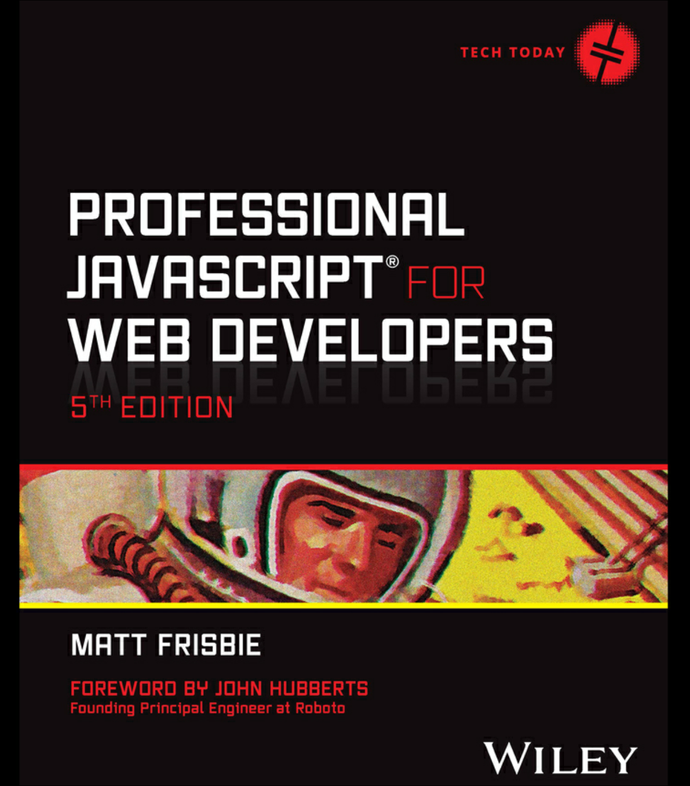

# Notes on Professional JavaScript for Web Developers

## Book Resources
- [Source Code](http://www.wiley.com/go/projavascript5e)

## General Notes

**Declaration Best Practices**
- Don't use `var`
- Prefer `const` over `let`

**The `typeof` Operator**  
Returns one of the following strings:
- "undefined" if the value is undefined
- "boolean" if the value is a boolean
- "string" if the value is a string
- "number" if the value is a number
- "object" if the value is an object
- "function" if the value is a function
- "symbol" if the value is a symbol
- "bigint" if the value is a BigInt

Calling `typeof null` returns an object, as the special value `null` is considered to be an empty object reference.

**The `Undefined` Type**  
- Uninitialized variables are `undefined`. 
- `undefined` is falsy, but be careful in scenarios where you need to test for an exact value of undefined rather than just a falsy value.
- See [01-undefined_type.js](ch03/01-undefined_type.js) for examples.

**The `Null` Type**
- Like `undefined`, the Null type has only one value: `null`.
- When declaring a variable intended to hold an object, it's best to initialize it to null. This makes it easy to check later whether the variable has been assigned an object reference.
- 
